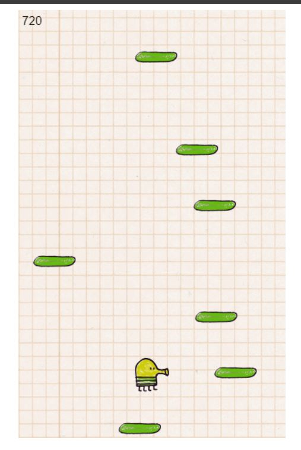
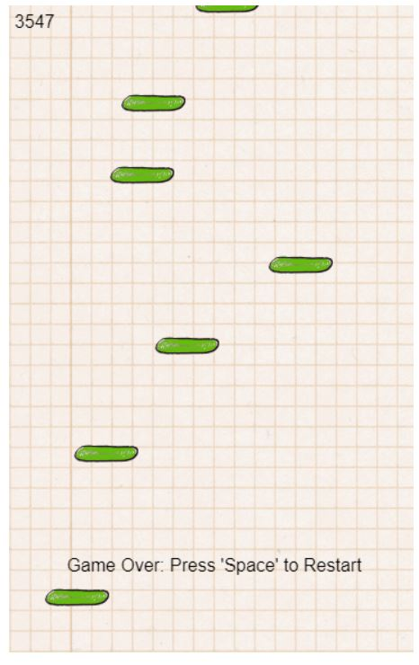

## Doodle Jump: A JavaScript Game

##### This JavaScript code brings the popular mobile game Doodle Jump to life in your web browser! Help the quirky Doodle creature jump and climb platforms, avoiding falling and aiming for the highest score.

### Features:

- Endless Gameplay: Platforms continuously generate, encouraging you to climb higher and score more points.
- Platform Interaction: Jump from platform to platform, gaining height and collecting points.
- Gravity Simulation: The Doodler falls naturally, requiring precise jumps to stay afloat.
- Left-Right Movement: Control the Doodler's movement left and right to land on platforms.
- Mobile-Inspired Graphics: Pixel art graphics evoke the classic Doodle Jump experience.
- Score Tracking: Your current score and highest score (max score) are displayed for you to track your progress.
- Restart Functionality: After a game over, press the spacebar to restart and try for a better score.

### Getting Started

- Prerequisites: Ensure you have a basic understanding of HTML, CSS, and JavaScript.
- Set Up Files:
- Create two files: doodlejump.html and doodlejump.js.
- Copy the HTML code provided in this README into doodlejump.html.
- Copy the JavaScript code provided in this README into doodlejump.js.

### Run the Game:

- Open the doodlejump.html file in your web browser to start playing.

### The code is organized into several key functions:

- window.onload: This function executes when the web page finishes loading. It - performs the following tasks:
- Retrieves a reference to the HTML canvas element with the ID "board".
- Sets the width and height of the canvas to create the game board.
- Obtains the 2D drawing context for the canvas, used for drawing game elements.
- Loads images for the Doodler (left and right facing), platforms, and sets initial game values.
- Starts the game loop using requestAnimationFrame for smooth animation.
- Adds event listeners for "keydown" events to handle Doodler movement and spacebar press for restarting.
- update: This function is called repeatedly within the game loop, responsible for - updating the game state and drawing the game elements. Here's what it does:
- Clears the canvas to prepare for a new frame.
- Updates the Doodler's horizontal position based on velocityX, ensuring it stays within game board boundaries.
- Updates the Doodler's vertical position based on velocityY (gravity) and collision detection with platforms.
- Updates platform positions by sliding them downwards while the Doodler ascends.
- Checks for collision between the Doodler and platforms. If a collision occurs on the bottom side, the Doodler jumps.
- Renders the Doodler image on the canvas, switching between left and right facing based on movement direction.
- Renders all platform images on the canvas.
- Cleans up platforms that move off the bottom of the canvas and adds a new platform at the top.
- Updates the score based on the Doodler's vertical movement (jumping higher increases score).
- Displays the current score and highest score on the canvas.
- Ends the game and displays a "Game Over" message upon reaching the bottom or exceeding maximum height.
- moveDoodler: This function detects key presses (left/right arrows or A/D keys) and sets the Doodler's horizontal velocity accordingly. It also switches the Doodler image to indicate the facing direction.
- placePlatforms: This function creates an initial set of platforms with varying positions at the top of the game board.
- newPlatform: This function is called to generate a new platform above the visible area when the previous one disappears off-screen.
- detectCollision: This function takes two objects as arguments and checks for collision using bounding box intersection logic. It returns true if a collision occurs, otherwise false.
- updateScore: This function calculates points based on the Doodler's vertical movement and updates the score and highest score accordingly.

